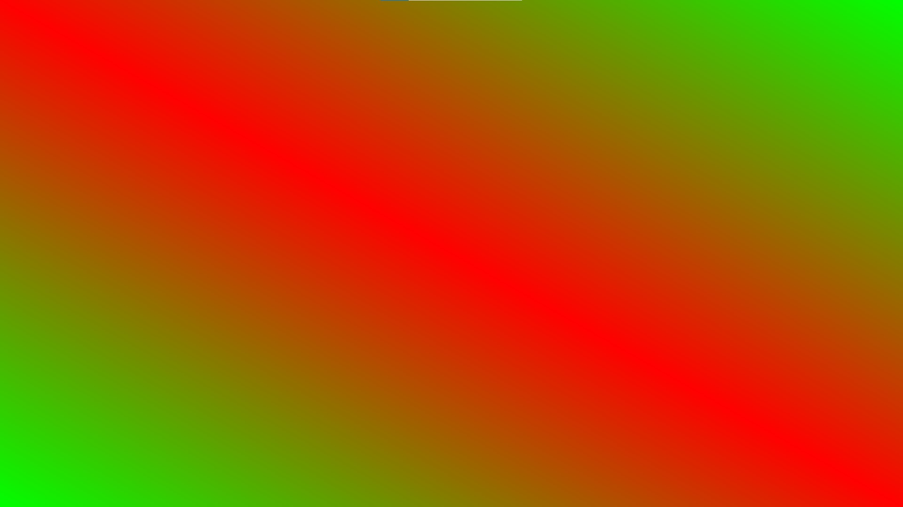

# DuckGL

Not is the most fast.

Not is the most beautiful.

Not is the most easy.

But is a bit fast, beautiful and easy.

A library based on OpenTK which is based on OpenGL.

Duck has a API similar to System.Drawing.Graphics.

# Tutorials and Examples

## Create a Fullscreen window for your apps

```cs
using DuckGL;

Window.OnKeyDown += key =>
{
    if (key == Input.Escape)
        Window.Close();
}
// Or use:
// Window.CloseOn(Input.Escape);

Window.Open();
```

## Create Shaders with C#

```cs
using DuckGL;
using static DuckGL.Shaders;

Graphics g = null;

Window.OnLoad += delegate
{
    g = Window
    .CreateGraphics()
    .SetVertexShader(() =>
    {
        layout(0, vec3, out var pos);
        gl_Position = vec(pos, 1.0);
    })
    .SetFragmentShader(() =>
    {
        uniform(vec4, out var color);
        gl_FragColor = color;
    });
};

Window.OnRender += delegate
{
    var size = 50;
    var i = Vector.i; // x-axis vector
    var j = Vector.j; // y-axis vector

    var center = (Window.Width / 2, Window.Height / 2);

    // using vetorial algebra to build a centralized square
    var topLeftPt  = center + size * (-i -j);
    var topRightPt = center + size * (+i -j);
    var botRightPt = center + size * (+i +j);
    var botLeftPt  = center + size * (-i +j);
    
    // clear scream
    g.Clear(Color.White);
    
    // filling square
    g.FillPolygon(
        Color.Blue,
        topLeftPt,
        topRightPt,
        botRightPt,
        botLeftPt
    );

    // drawing border of square
    g.DrawPolygon(
        Color.Black,
        topLeftPt,
        topRightPt,
        botRightPt,
        botLeftPt
    );
};

Window.CloseOn(Input.Escape);

Window.Open();
```
Result:


## Control layout and use DuckGL data types like ColoredVertice

```cs
using DuckGL;
using static DuckGL.Shaders;

Graphics g = null;

Window.OnLoad += delegate
{
    g = Window
        .CreateGraphics()
        .SetVertexShader(() =>
        {
            layout(0, vec3, out var pos);
            layout(1, vec4, out var color);

            gl_Position = vec(pos, 1.0);
            outVar(vec4, "vertexColor", color);
        })
        .SetFragmentShader(() =>
        {
            inVar(vec4, "vertexColor", out var vertexColor);

            gl_FragColor = vertexColor;
        });
};

Window.OnRender += delegate
{
    var red = Color.Red;
    var green = Color.Green;
    var w = Window.Width;
    var h = Window.Height;

    g.FillPolygon(
        (0, 0, 0, red),
        (w, 0, 0, green),
        (w, h, 0, red),
        (0, h, 0, green)
    );
};

Window.CloseOn(Input.Escape);

Window.Open();
```
Result:


## Use GLSL functions

```cs
using System;
using DuckGL;
using static DuckGL.Shaders;

Graphics g = null;
DateTime start = DateTime.Now;

Window.OnLoad += delegate
{
    g = Window
        .CreateGraphics()
        .SetVertexShader(() =>
        {
            layout(0, vec3, out var pos);
            gl_Position = vec(pos, 1.0);
        })
        .SetFragmentShader(() =>
        {
            uniform(single, out var time);

            var red = vec(1.0, 0.0, 0.0);
            var blue = vec(0.0, 0.0, 1.0);

            var timeData = sin(time);
            var interpolation = smoothstep(-1, 1, timeData);

            gl_FragColor = vec(mix(red, blue, interpolation), 1.0);
        });
};

Window.OnRender += delegate
{
    var time = (DateTime.Now - start).TotalSeconds;
    
    var w = Window.Width;
    var h = Window.Height;

    g.FillPolygon(
        time,
        (0, 0, 0),
        (w, 0, 0),
        (w, h, 0),
        (0, h, 0)
    );
};

Window.CloseOn(Input.Escape);

Window.Open();
```

# Versions

### DuckGL v0.3.0 (coming soon)

### DuckGL v0.2.0

 -  Graphics Class
 -  GraphicsBuilder Class
 -  Color Record
 -  ColoredVertex Record
 -  Shaders Class
 -  ShaderSupport Namespace
    -  ShaderContext Class
    -  ShaderConverter Class
    -  ShaderObject Class
    -  ShaderType Enum

### DuckGL v0.1.0

 -  Window Class
    - Open and Close Methods
    - Events
 -  Input Enum
 -  Vector Record
 -  Vertex Record
 -  Graphics Class
    - Clear Method
    - DrawPolygon Method
    - FillPolygon Method
